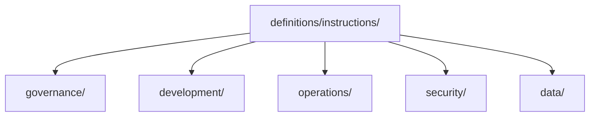

# Instruction Definitions

> Canonical repository instructions authored once and consumed by runtime and provider projections.

---

## Purpose

`definitions/instructions/` is the canonical root for stable instruction content.

The lane is intentionally shallow and uses five predictable categories:

- `governance/`
- `development/`
- `operations/`
- `security/`
- `data/`

Specialization should prefer stable `ntk-*` file names instead of deep folder nesting.

Typical specialization patterns:

- `ntk-governance-*` for repository invariants and workflow contracts
- `ntk-development-*` for backend, frontend, agentic, persistence, and testing guidance
- `ntk-operations-*` for DevOps, platform, reliability, quality, and workspace operations
- `ntk-security-*` for supply-chain, application, and vulnerability hardening
- `ntk-data-*` for database and privacy/data-governance concerns

---

### Architecture

---

## Notes

- `definitions/shared/instructions/` remains available during migration.
- Author new canonical instruction content here first when the new lane exists.
- Provider consumers should eventually project from this root instead of from legacy paths.
- Category folders under `definitions/instructions/` intentionally do not carry their own `README.md`; keep the lane contract centralized here and inside the file names themselves.

---