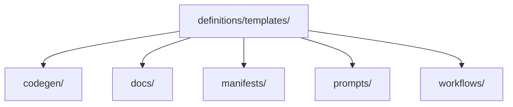

# Template Definitions

> Canonical reusable authored templates used by documentation, manifests, prompts, workflows, and code generation.

---

## Purpose

`definitions/templates/` owns reusable authored templates that should remain canonical and tool-consumable.

The root is organized by template type:

- `codegen/`
- `docs/`
- `manifests/`
- `prompts/`
- `workflows/`

---

### Architecture

---

## Notes

- Root `templates/` remains available during migration and should be retired only after canonical content is moved safely.
- `definitions/shared/templates/` remains as a temporary compatibility surface only while canonical consumers finish switching to `definitions/templates/`.
- Human-facing examples belong in `docs/samples/`; canonical authored templates belong here.

---