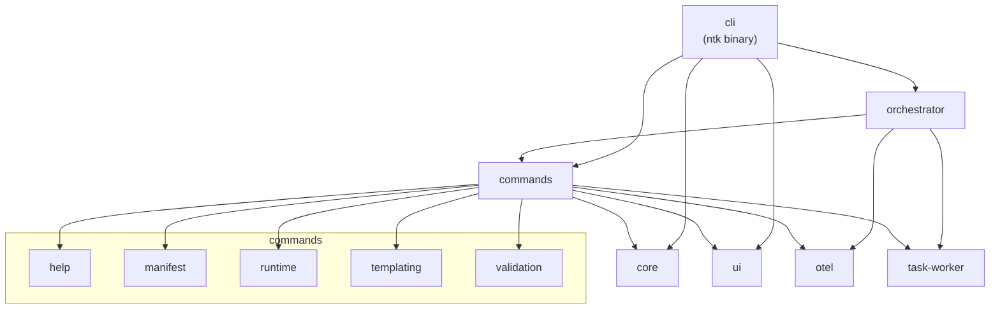

# NetToolsKit Copilot Workspace

> Rust workspace for the NetToolsKit Copilot toolchain, combining CLI commands, runtime orchestration, compatibility wrappers, projected provider surfaces, and versioned planning/spec governance.

---

## Introduction

NetToolsKit Copilot is a multi-crate Rust workspace that centralizes command boundaries, repository-managed runtime surfaces, and versioned governance artifacts. It is designed to keep orchestration, validation, documentation, and projected editor/provider surfaces aligned while the workspace migrates from PowerShell-first compatibility wrappers to native Rust command surfaces.

Objectives:

- Provide a single Rust workspace for CLI, runtime, validation, orchestration, and support surfaces
- Keep repository automation deterministic through versioned projections and planning artifacts
- Preserve local-first operation while supporting projected MCP and editor surfaces
- Retire PowerShell wrappers only when the Rust command boundary is complete and validated

---

## Features

- ✅ Rust crates for CLI entry points, orchestration, commands, telemetry, runtime validation, and UI boundaries
- ✅ Versioned projection model for `.github/`, `.codex/`, `.claude/`, and `.vscode/`
- ✅ Native MCP runtime projection and Codex config application from a canonical catalog
- ✅ Local RAG/CAG context index and weekly AI usage ledger for deterministic repo recall
- ✅ Built-in AI provider profiles plus `ntk ai doctor` diagnostics, smart routing strategy scoring, normalized adapter contracts, canonical agent/skill model-routing defaults, and matrix-aware usage reporting for balanced, coding, cheap, latency, and local orchestrator presets
- ✅ Explicit agentic surface separation for MCP, A2A, RAG, and CAG
- ✅ Versioned control-plane inspection schemas for `ntk ai doctor` and `ntk runtime doctor` machine output
- ✅ Deterministic planning, specification, and reference docs under `planning/`
- ✅ Compatibility wrappers retained only where they still provide operator entry points

---

## Contents

- [Introduction](#introduction)
- [Features](#features)
- [Contents](#contents)
  - [Command Reference](#command-reference)
  - [Architecture](#architecture)
  - [Control Plane Model](#control-plane-model)
  - [Crates](#crates)
  - [Compatibility and Support](#compatibility-and-support)
  - [Operations](#operations)
  - [Planning](#planning)
  - [Governance and Security](#governance-and-security)
- [Build and Tests](#build-and-tests)
- [Contributing](#contributing)
- [Dependencies](#dependencies)
- [References](#references)
- [License](#license)

---

## Command Reference

Run `ntk --help` for the current top-level surface. If no command is provided, `ntk [PROMPT]` starts the interactive CLI.

### Top-Level Commands

| Surface | Command | Description |
| --- | --- | --- |
| Interactive | `ntk [PROMPT]` | Launch the interactive CLI when no explicit subcommand is supplied |
| Manifests | `ntk manifest` | Manage and apply manifests |
| AI | `ntk ai` | Execute AI-focused command surfaces |
| Runtime | `ntk runtime` | Execute repository runtime hook and maintenance surfaces |
| Validation | `ntk validation` | Execute native repository validation checks |
| Completions | `ntk completions <shell>` | Generate shell completions for `bash`, `elvish`, `fish`, `powershell`, or `zsh` |
| Service | `ntk service` | Run background HTTP service mode |

### Manifest Commands

| Command | Description |
| --- | --- |
| `ntk manifest list` | Discover available manifests in the workspace |
| `ntk manifest check` | Validate manifest structure and dependencies |
| `ntk manifest render` | Preview generated files without applying changes |
| `ntk manifest apply` | Apply a manifest file to generate or update files |

### AI Commands

| Command | Description |
| --- | --- |
| `ntk ai doctor` | Diagnose active AI profile, provider chain, routing strategy, adapter contracts, timeout, and remote readiness without executing a request, with a typed JSON control schema for machine consumers |
| `ntk ai model-routing list` | List canonical agent and skill model-routing defaults consumed by the development orchestrator |
| `ntk ai model-routing show` | Show the resolved active agent/skill routing selection or an explicit lane pairing |
| `ntk ai profiles list` | List built-in AI provider profiles and their provider-mode classifications |
| `ntk ai profiles show [profile]` | Show one AI provider profile or the active `NTK_AI_PROFILE` preset |
| `ntk ai usage weekly` | Report one ISO week of persisted local AI usage history plus current route, fallback posture, and compatible free-provider families |
| `ntk ai usage summary` | Report a bounded recent multi-week summary of persisted local AI usage history plus current route, fallback posture, and compatible free-provider families |

### Runtime Commands

| Command | Description |
| --- | --- |
| `ntk runtime pre-tool-use` | Normalize hook payloads for VS Code `PreToolUse` |
| `ntk runtime doctor` | Run the native runtime doctor workflow, with human-readable output or a typed JSON control schema |
| `ntk runtime healthcheck` | Run the native runtime healthcheck workflow |
| `ntk runtime self-heal` | Run the native runtime self-heal workflow |
| `ntk runtime clean-build-artifacts` | Discover and optionally remove `.build`, `.deployment`, `bin`, and `obj` artifact directories under the selected path, with measured byte totals for the cleanup footprint |
| `ntk runtime update-local-context-index` | Build or refresh the repository-owned local context index |
| `ntk runtime query-local-context-index` | Query the repository-owned local context index |
| `ntk runtime update-local-memory` | Build or refresh the repository-owned SQLite local memory snapshot |
| `ntk runtime query-local-memory` | Query the repository-owned SQLite local memory snapshot |
| `ntk runtime export-planning-summary` | Export a context handoff summary from active planning artifacts |
| `ntk runtime export-enterprise-trends` | Export enterprise validation and vulnerability trends |
| `ntk runtime apply-vscode-templates` | Apply tracked VS Code template files into active workspace files |
| `ntk runtime render-vscode-mcp-template` | Render the tracked VS Code MCP template from the canonical catalog |
| `ntk runtime render-provider-surfaces` | Render tracked provider surfaces from the canonical projection catalog |
| `ntk runtime render-mcp-runtime-artifacts` | Render the tracked VS Code and Codex MCP artifacts from the canonical catalog |
| `ntk runtime sync-codex-mcp-config` | Apply MCP server definitions into the local Codex `config.toml` |
| `ntk runtime trim-trailing-blank-lines` | Trim trailing whitespace and blank lines from text files |
| `ntk runtime pre-commit-eof-hygiene` | Apply staged-file EOF hygiene for repository pre-commit flows |
| `ntk runtime setup-git-hooks` | Configure repository-local or managed-global Git hooks |
| `ntk runtime setup-global-git-aliases` | Configure managed global Git aliases |

### Validation Commands

| Command | Description |
| --- | --- |
| `ntk validation all` | Run the full validation orchestration for one profile |
| `ntk validation agent-orchestration` | Validate multi-agent orchestration contracts and runtime assets |
| `ntk validation agent-permissions` | Validate agent permission matrix and stage command contracts |
| `ntk validation agent-skill-alignment` | Validate agent skill references against manifests, pipeline, and evals |
| `ntk validation agent-hooks` | Validate repository-owned VS Code/Codex hook assets |
| `ntk validation audit-ledger` | Validate the audit ledger hash chain |
| `ntk validation authoritative-source-policy` | Validate the centralized authoritative documentation policy and source map |
| `ntk validation architecture-boundaries` | Validate repository architecture boundary baselines |
| `ntk validation instruction-architecture` | Validate instruction architecture ownership and boundary rules |
| `ntk validation instructions` | Validate repository instruction and authored guidance assets |
| `ntk validation instruction-metadata` | Validate instruction, prompt, and chat mode frontmatter metadata |
| `ntk validation compatibility-lifecycle-policy` | Validate `COMPATIBILITY.md` lifecycle and EOL semantics |
| `ntk validation dotnet-standards` | Validate `.NET` template standards under `.github/templates` |
| `ntk validation policy` | Validate repository policy contracts under `.github/policies` |
| `ntk validation planning-structure` | Validate versioned planning workspace structure |
| `ntk validation powershell-standards` | Validate PowerShell script standards across repository scripts |
| `ntk validation readme-standards` | Validate README files against repository standards |
| `ntk validation routing-coverage` | Validate routing catalog coverage against golden fixtures |
| `ntk validation runtime-script-tests` | Validate runtime PowerShell smoke tests |
| `ntk validation security-baseline` | Validate repository security baseline contracts |
| `ntk validation shared-script-checksums` | Validate shared script checksum manifest integrity |
| `ntk validation shell-hooks` | Validate shell hook syntax and semantic guards |
| `ntk validation supply-chain` | Validate local supply-chain baseline and export SBOM evidence |
| `ntk validation template-standards` | Validate shared repository template standards |
| `ntk validation release-governance` | Validate release governance contracts and release guardrails |
| `ntk validation release-provenance` | Validate release provenance evidence and git traceability |
| `ntk validation warning-baseline` | Validate analyzer warning volume against the warning baseline |
| `ntk validation workspace-efficiency` | Validate VS Code workspace efficiency and configuration hygiene |

### Global Flags

| Flag | Description |
| --- | --- |
| `--log-level <level>` | Set logging level: `off`, `error`, `warn`, `info`, `debug`, `trace` |
| `--config <path>` | Point the CLI at an explicit configuration file |
| `-v`, `--verbose` | Enable verbose output |
| `-V`, `--version` | Print version |

---

### Architecture



### Agentic Surfaces

This workspace separates agentic capabilities by responsibility so each technology has a clear maintenance boundary.

| Surface | Role | Current repo entry points | Status |
| --- | --- | --- | --- |
| MCP | Tool projection and runtime configuration for Codex and editor surfaces | `.github/`, `.codex/`, `crates/commands/runtime/src/sync/mcp_config.rs`, `crates/commands/runtime/src/sync/mcp_runtime_artifacts.rs` | Supported |
| A2A | Agent-to-agent interoperability and horizontal task delegation | Planning only; no dedicated runtime surface yet | Planned |
| RAG | Repo-local retrieval for instructions, plans, and source context | `crates/core/src/local-context/`, `scripts/common/local-context-index.ps1` | Supported |
| CAG | Context-augmented generation, compaction, and token-budget aware prompting | `crates/core/src/ai_context.rs`, `crates/orchestrator/src/execution/ai_usage.rs`, `scripts/runtime/invoke-super-agent-housekeeping.ps1` | Supported / evolving |

MCP owns tool and provider projection, RAG owns deterministic recall, CAG owns prompt shaping and budget-aware context assembly, and A2A remains the future boundary for agent-to-agent interoperability.

---

### AI Provider Matrix

The workspace also keeps the free/provider-preview evaluation matrix separate from MCP, A2A, RAG, and CAG so provider-family assumptions do not leak into orchestration or docs ad hoc.

| Family | Mode | Support Tier | Canonical entry point |
| --- | --- | --- | --- |
| OpenRouter | gateway / OpenAI-compatible | best-effort-free | `definitions/templates/manifests/free-llm-provider-matrix.catalog.json` |
| Groq | API / OpenAI-compatible | best-effort-free | `definitions/templates/manifests/free-llm-provider-matrix.catalog.json` |
| Google AI Studio | native API | best-effort-free | `definitions/templates/manifests/free-llm-provider-matrix.catalog.json` |
| Together AI | gateway / OpenAI-compatible | best-effort-free | `definitions/templates/manifests/free-llm-provider-matrix.catalog.json` |
| Hugging Face Inference API | hosted inference API | best-effort-free | `definitions/templates/manifests/free-llm-provider-matrix.catalog.json` |
| NVIDIA NIM Preview | infra / OpenAI-compatible | preview | `definitions/templates/manifests/free-llm-provider-matrix.catalog.json` |
| OpenCode.ai | orchestrator / proxy | best-effort-free | `definitions/templates/manifests/free-llm-provider-matrix.catalog.json` |

`ntk ai usage weekly` and `ntk ai usage summary` expose the active runtime route, fallback posture, and compatible free-provider families from that catalog without changing production provider selection.

---

### Runtime Diagnostics Model

Runtime health, degraded-state evidence, and subsystem ownership are versioned separately from raw logs and validation rules.

| Element | Role | Canonical entry point |
| --- | --- | --- |
| Diagnostics taxonomy | Defines `healthy`, `degraded`, `blocked`, `misconfigured`, and `recovering` plus subsystem ownership | `definitions/templates/manifests/runtime-diagnostics.taxonomy.json` |
| Control-schema catalog | Defines machine-readable doctor schema kinds, entry points, and versioning rules | `definitions/templates/manifests/control-plane-introspection.catalog.json` |
| Operator playbook | Human troubleshooting and remediation flow | `docs/operations/runtime-diagnostics-observability-playbook.md` |
| Current doctor surface | Read-only runtime inspection for AI/runtime health with versioned machine-readable contracts | `ntk ai doctor`, `ntk runtime doctor` |

Future MCP, recall, task, and service doctor/report surfaces should reuse the same taxonomy and the same typed control-schema style instead of inventing per-command state names or one-off JSON payloads.

---

### Extension Model

Extension classes are governed separately from agentic surfaces so agents, skills, hooks, prompts, and runtime projections do not collapse into one ambiguous plugin layer.

| Class | Canonical authored root | Governance contract |
| --- | --- | --- |
| Agents | `definitions/agents/` | `definitions/templates/manifests/extension-governance.catalog.json` |
| Skills | `definitions/skills/` | `definitions/templates/manifests/extension-governance.catalog.json` |
| Hooks | `definitions/hooks/` | `definitions/templates/manifests/extension-governance.catalog.json` |
| Provider prompts and projections | `definitions/providers/*/` | `definitions/templates/manifests/extension-governance.catalog.json` |

Provider mirrors consume these roots, but they do not replace them as authored sources of truth.

---

### Operational Memory Model

File-based operational memory is governed separately from both `planning/` and the SQLite-backed recall store so curated memory stays small, reviewable, and indexable.

| Layer | Role | Canonical contract |
| --- | --- | --- |
| Entrypoint memory | concise always-loadable memory | `definitions/templates/manifests/operational-memory-layering.catalog.json` |
| Topic memory | curated subsystem/topic detail | `definitions/templates/manifests/operational-memory-layering.catalog.json` |
| Operational notes | append-only intake for later distillation | `definitions/templates/manifests/operational-memory-layering.catalog.json` |

RAG may retrieve these files and CAG may compact them, but `planning/` remains the execution workspace and SQLite remains the retrieval store rather than the editorial source.

---

### Control Plane Model

Formal control-plane, session, and operator contracts are documented in:

- [Control Plane, Session, and Operator Model](docs/architecture/control-plane-session-operator-model.md)
- [Control-Plane Introspection Model](docs/architecture/control-plane-introspection-model.md)

This document defines the current local-first runtime boundary and the target contract for future gateway/operator expansion. Local CLI `/task submit`, HTTP `/task/submit`, and ChatOps task commands derive the same typed control-plane metadata, with normalized request, operator, session, and audit attribution across submit and non-submit ingress paths.

---

### Crates

This workspace is organized as a multi-crate Rust project. Each crate has its own README with scoped documentation.

| Crate | Description | README |
| --- | --- | --- |
| `cli` | Interactive entry point, top-level command routing, and CLI UX | [crates/cli/README.md](crates/cli/README.md) |
| `core` | Shared domain types, configuration, path resolution, local context, and common utilities | [crates/core/README.md](crates/core/README.md) |
| `ui` | Terminal UI primitives, color/unicode detection, and rendering helpers | [crates/ui/README.md](crates/ui/README.md) |
| `otel` | Local observability, metrics, timers, and telemetry helpers | [crates/otel/README.md](crates/otel/README.md) |
| `orchestrator` | AI orchestration, ChatOps, repo workflow handling, and usage history | [crates/orchestrator/README.md](crates/orchestrator/README.md) |
| `commands` | Command boundary and feature crate grouping | [crates/commands/README.md](crates/commands/README.md) |
| `help` | Help discovery and manifest listing | [crates/commands/help/README.md](crates/commands/help/README.md) |
| `manifest` | Manifest parsing, validation, and apply/render helpers | [crates/commands/manifest/README.md](crates/commands/manifest/README.md) |
| `runtime` | Runtime bootstrap, drift diagnosis, self-heal, continuity, and maintenance surfaces | [crates/commands/runtime/README.md](crates/commands/runtime/README.md) |
| `templating` | Handlebars template rendering | [crates/commands/templating/README.md](crates/commands/templating/README.md) |
| `validation` | Native validation orchestration and repository policy checks | [crates/commands/validation/README.md](crates/commands/validation/README.md) |
| `task-worker` | Background task execution worker for orchestrated flows | [crates/task-worker/README.md](crates/task-worker/README.md) |

Workspace boundary overview:

- [Rust Crates Workspace](crates/README.md)

---

### Compatibility and Support

Official platform compatibility tiers and support commitments are defined in:

- [Compatibility Matrix and Support Policy](COMPATIBILITY.md)

This document includes the support lifecycle and release policy by minor version. The runtime currently projects MCP-based surfaces and repo-local RAG/CAG recall; A2A is tracked as a future interoperability boundary and ACP is not yet a dedicated first-class repository surface.

---

### Operations

Operational runbooks and incident procedures:

- [Documentation Tree](docs/README.md)
- [Incident Response and Troubleshooting Playbook](docs/operations/incident-response-playbook.md)
- [AI Development Operator Playbook](docs/operations/ai-development-operator-playbook.md)
- [Runtime Diagnostics and Observability Playbook](docs/operations/runtime-diagnostics-observability-playbook.md)
- [Release Artifact Verification Guide](docs/operations/release-artifact-verification.md)
- [Local Service Mode Runbook](docs/operations/service-mode-local-runbook.md)
- [ChatOps Agent VPS Profile](docs/operations/chatops-agent-vps-profile.md)
- [ChatOps Reverse Proxy Profiles](docs/operations/chatops-reverse-proxy-profiles.md)
- [TUI UX Guidelines](docs/ui/tui-ux-guidelines.md)

---

### Planning

Canonical planning documents live in:

- [Planning Index](planning/README.md)
- [Planning Specs Index](planning/specs/README.md)
- [Definitions Tree](definitions/README.md)

Active workstreams are kept under `planning/active/`, and completed workstreams move to `planning/completed/` after implementation, validation, and closeout.

---

### Governance and Security

- [License](LICENSE)
- [Security Policy](SECURITY.md)
- [Contributing Guide](CONTRIBUTING.md)
- [Code Ownership](.github/CODEOWNERS)
- [Changelog](CHANGELOG.md)

Security issues should use the private disclosure path documented in `SECURITY.md`.

---

## Build and Tests

This repository uses standard Cargo workflows for building, testing, formatting, linting, and validation.

Workspace build and validation artifacts are centralized through `.cargo/config.toml` and CI/runtime path conventions under:

- `./.build/cargo-target`
- `./.build/coverage`
- `./.deployment/local/service-data`

```bash
cargo build --workspace
cargo test --workspace
cargo fmt --all -- --check
cargo clippy --workspace --all-targets -- -D warnings
ntk validation all --repo-root . --warning-only false
pwsh -NoProfile -File scripts/security/Invoke-RustPackageVulnerabilityAudit.ps1 -RepoRoot $PWD -ProjectPath . -FailOnSeverities Critical,High
```

---

## Contributing

We follow semantic versioning and conventional commits. Please ensure your contributions:

1. Follow Git Flow by creating feature branches from `main`
2. Update planning/specs for non-trivial changes before implementation
3. Write tests for new behavior and keep existing coverage stable
4. Use semantic commits such as `feat:`, `fix:`, `docs:`, or `refactor:`
5. Keep the README and linked docs current when workspace structure changes
6. Pass CI-level validation before merging

---

## Dependencies

### Runtime

| Area | Examples | Purpose |
| --- | --- | --- |
| CLI/runtime | `tokio`, `clap`, `crossterm`, `serde`, `tracing` | Async execution, command parsing, terminal handling, serialization, structured logs |
| Rendering/templates | `handlebars`, `owo-colors`, `supports-color` | Template rendering and terminal output styling |
| Networking | `reqwest`, `url` | HTTP clients and endpoint handling |
| Local memory | SQLite-backed context and usage stores | RAG/CAG recall and AI usage history |
| Compatibility | PowerShell 7+ | Retained wrapper entrypoints and operator surfaces |

### Development

| Area | Examples | Purpose |
| --- | --- | --- |
| Testing | `insta`, `assert_cmd`, `tempfile`, `serial_test` | Snapshots, CLI integration tests, fixtures, serialized execution |
| Quality | Cargo fmt, Cargo clippy, Cargo test | Build, lint, and test gates |
| Runtime assets | Codex/Copilot projection files and MCP catalogs | Projected provider surfaces and local runtime sync |

---

## References

### Workspace Docs

- [Rust Crates Workspace](crates/README.md)
- [Definitions Tree](definitions/README.md)
- [Provider Definitions](definitions/providers/README.md)
- [Shared Definitions](definitions/shared/README.md)
- [Deployment Assets](deployments/README.md)
- [Documentation Tree](docs/README.md)
- [Scripts](scripts/README.md)
- [Template Assets](templates/README.md)
- [Control Plane, Session, and Operator Model](docs/architecture/control-plane-session-operator-model.md)
- [Control-Plane Introspection Model](docs/architecture/control-plane-introspection-model.md)
- [Extension Governance Model](docs/architecture/extension-governance-model.md)
- [Operational Memory Layering Model](docs/architecture/operational-memory-layering-model.md)
- [Incident Response and Troubleshooting Playbook](docs/operations/incident-response-playbook.md)
- [AI Development Operator Playbook](docs/operations/ai-development-operator-playbook.md)
- [Release Artifact Verification Guide](docs/operations/release-artifact-verification.md)
- [Local Service Mode Runbook](docs/operations/service-mode-local-runbook.md)
- [ChatOps Agent VPS Profile](docs/operations/chatops-agent-vps-profile.md)
- [ChatOps Reverse Proxy Profiles](docs/operations/chatops-reverse-proxy-profiles.md)
- [TUI UX Guidelines](docs/ui/tui-ux-guidelines.md)
- [Compatibility Matrix and Support Policy](COMPATIBILITY.md)
- [Contributing Guide](CONTRIBUTING.md)
- [Security Policy](SECURITY.md)
- [Planning Index](planning/README.md)
- [Planning Specs Index](planning/specs/README.md)

### External References

- [Rust Async Book](https://rust-lang.github.io/async-book/)
- [Clap CLI Framework](https://docs.rs/clap/latest/clap/)
- [Tokio Async Runtime](https://tokio.rs/tokio/tutorial)
- [Handlebars Template Engine](https://docs.rs/handlebars/latest/handlebars/)
- [Crossterm Terminal Library](https://docs.rs/crossterm/latest/crossterm/)
- [OpenAI Codex](https://github.com/openai/codex)

---

## License

This project is licensed under the MIT License. See the LICENSE file at the repository root for details.

---