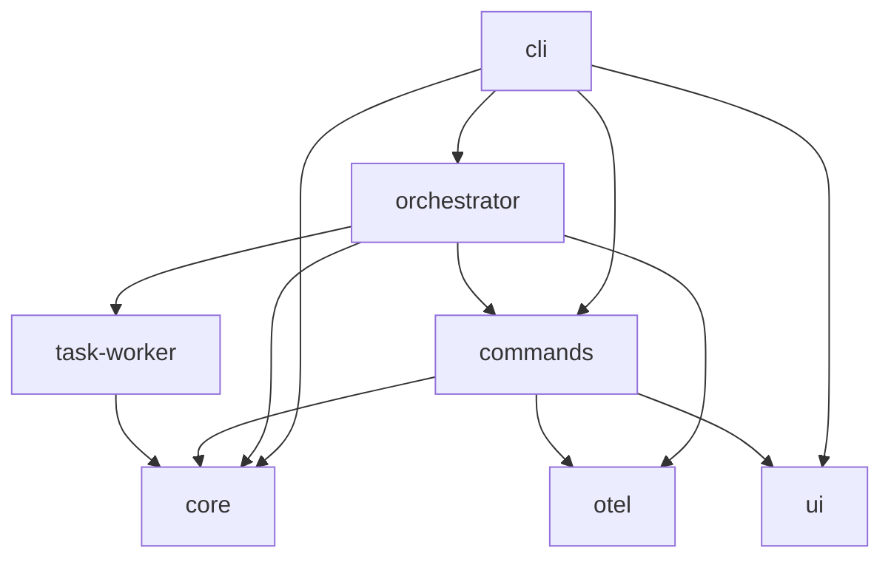

# Rust Crates Workspace

> Repository-owned Rust crate boundaries that implement the `ntk` runtime, orchestration, validation, and terminal surfaces.

---

## Introduction

`crates/` contains the Rust workspace that powers the `ntk` CLI, runtime automation, orchestration, validation, task execution, observability, and UI layers.

Each crate keeps a scoped README and a narrow responsibility so the workspace can evolve without collapsing runtime, domain, and terminal concerns into a single package.

---

## Features

- ✅ Split workspace boundaries for CLI, orchestration, runtime commands, validation, UI, and shared core types
- ✅ Stable crate-level documentation with scoped ownership per package
- ✅ Native Rust-first runtime and validation surfaces behind the `ntk` entrypoint
- ✅ Clear dependency direction between interface, orchestration, and shared-domain layers

---

## Contents

- [Introduction](#introduction)
- [Features](#features)
- [Contents](#contents)
  - [Architecture](#architecture)
  - [Workspace Crates](#workspace-crates)
  - [Build and Tests](#build-and-tests)
- [References](#references)
- [License](#license)

---

### Architecture



---

## Workspace Crates

| Crate | Responsibility | README |
| --- | --- | --- |
| `cli` | Command-line entrypoint and typed command dispatch for `ntk`. | [crates/cli/README.md](cli/README.md) |
| `commands` | Facade over the command crates used by the workspace. | [crates/commands/README.md](commands/README.md) |
| `core` | Shared domain types, configuration, local-context, and common utilities. | [crates/core/README.md](core/README.md) |
| `orchestrator` | High-level AI, runtime, and execution orchestration. | [crates/orchestrator/README.md](orchestrator/README.md) |
| `otel` | Timing, telemetry, and observability helpers. | [crates/otel/README.md](otel/README.md) |
| `task-worker` | Background task execution primitives. | [crates/task-worker/README.md](task-worker/README.md) |
| `ui` | Terminal rendering, capabilities, and display contracts. | [crates/ui/README.md](ui/README.md) |

The `commands/` facade further links to the scoped command crates:

- [crates/commands/help/README.md](commands/help/README.md)
- [crates/commands/manifest/README.md](commands/manifest/README.md)
- [crates/commands/runtime/README.md](commands/runtime/README.md)
- [crates/commands/templating/README.md](commands/templating/README.md)
- [crates/commands/validation/README.md](commands/validation/README.md)

---

## Build and Tests

```powershell
cargo build --workspace
cargo test --workspace
cargo clippy --workspace -- -D warnings
cargo fmt --all --check
```

---

## References

- [Repository README](../README.md)
- [Cargo.toml](../Cargo.toml)
- [crates/cli/README.md](cli/README.md)
- [crates/commands/README.md](commands/README.md)
- [crates/core/README.md](core/README.md)
- [crates/orchestrator/README.md](orchestrator/README.md)
- [crates/otel/README.md](otel/README.md)
- [crates/task-worker/README.md](task-worker/README.md)
- [crates/ui/README.md](ui/README.md)

---

## License

This project is licensed under the MIT License. See the LICENSE file at the repository root for details.

---