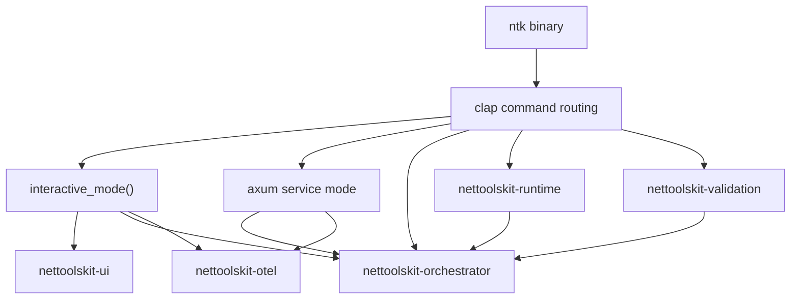

# nettoolskit-cli

> CLI entry point for the `ntk` developer orchestrator, covering interactive usage, command routing, local runtime operations, validation surfaces, and HTTP service mode.

---

## Introduction

`nettoolskit-cli` owns the `ntk` binary exposed by this workspace. It routes top-level command groups, hosts the interactive terminal experience, starts the local HTTP service surface, and bridges operator input into the orchestrator, runtime, validation, and UI crates.

---

## Features

- ✅ `ntk` binary entry point for the developer orchestrator
- ✅ Runtime, validation, manifest, completion, and service-mode routing
- ✅ Embedded interactive API for host applications and tests

| Surface | Capability |
| --- | --- |
| Interactive CLI | Starts the default terminal workflow when `ntk` is invoked without a subcommand |
| Manifest orchestration | Exposes `manifest list/check/render/apply` for workspace scaffolding and generation |
| Runtime operations | Exposes repository bootstrap, doctor, healthcheck, local-memory, provider-surface, and Git-hook utilities |
| Validation | Exposes the full native validation catalog for instructions, planning, release, security, and workspace hygiene |
| Service mode | Runs a local HTTP control plane with health, readiness, task submission, and optional ChatOps ingress |
| Shell integration | Generates completions for `bash`, `elvish`, `fish`, `powershell`, and `zsh` |
| Embedded API | Exposes `interactive_mode` and `InteractiveOptions` for host applications and tests |

---

## Contents

- [Introduction](#introduction)
- [Features](#features)
- [Contents](#contents)
- [Installation](#installation)
- [Quick Start](#quick-start)
- [Usage Examples](#usage-examples)
- [Command Surfaces](#command-surfaces)
  - [Top-Level Groups](#top-level-groups)
  - [Manifest Commands](#manifest-commands)
  - [AI Usage Commands](#ai-usage-commands)
  - [Runtime Highlights](#runtime-highlights)
- [Validation Highlights](#validation-highlights)
- [Service Mode](#service-mode)
- [Architecture](#architecture)
- [API Reference](#api-reference)
  - [Interactive Options](#interactive-options)
  - [Entry Point](#entry-point)
- [Build and Tests](#build-and-tests)
- [Contributing](#contributing)
- [Dependencies](#dependencies)
- [References](#references)
- [License](#license)

---

## Installation

Build the local binary from the workspace root:

```powershell
cargo build -p nettoolskit-cli
```

Run it directly from the workspace root:

```powershell
cargo run -q -p nettoolskit-cli -- --help
```

---

## Quick Start

Common operator entry points:

```powershell
# Interactive mode
ntk

# Discover manifests
ntk manifest list --repo-root .

# Run the native validation bundle
ntk validation all --repo-root . --warning-only false

# Check runtime health and drift
ntk runtime healthcheck --repo-root .

# Start local HTTP service mode
ntk service --host 127.0.0.1 --port 8080

# Enable PowerShell completions for the current session
ntk completions powershell | Out-String | Invoke-Expression
```

---

## Usage Examples

### Interactive session

```powershell
ntk
```

### Runtime health and drift check

```powershell
ntk runtime healthcheck --repo-root .
```

### Full repository validation

```powershell
ntk validation all --repo-root . --warning-only false
```

### Local service mode

```powershell
$env:NTK_SERVICE_AUTH_TOKEN = "local-dev-token"
ntk service --host 127.0.0.1 --port 8080
```

---

## Command Surfaces

Run `ntk --help` for the full live surface and per-command flags.

### Top-Level Groups

| Group | Command | Description |
| --- | --- | --- |
| Interactive | `ntk [PROMPT]` | Start the interactive CLI when no explicit subcommand is supplied |
| Manifest | `ntk manifest` | Manage workspace manifests and generated output |
| AI | `ntk ai` | Run AI-oriented reporting and usage surfaces |
| Runtime | `ntk runtime` | Run repository runtime maintenance, continuity, and projection commands |
| Validation | `ntk validation` | Run native repository policy and hygiene checks |
| Completions | `ntk completions <shell>` | Emit shell completion scripts |
| Service | `ntk service --host <host> --port <port>` | Start the local HTTP service runtime |

### Manifest Commands

| Command | Description |
| --- | --- |
| `ntk manifest list` | Discover manifests available in the workspace |
| `ntk manifest check` | Validate manifest structure and dependency references |
| `ntk manifest render` | Preview generated output without applying changes |
| `ntk manifest apply` | Apply a manifest to generate or update files |

### AI Commands

| Command | Description |
| --- | --- |
| `ntk ai doctor` | Diagnose active AI profile, provider chain, routing strategy, adapter contracts, timeout, and remote readiness |
| `ntk ai profiles list` | List built-in AI provider presets for development orchestration |
| `ntk ai profiles show [profile]` | Show one provider profile or the active `NTK_AI_PROFILE` preset |
| `ntk ai usage weekly` | Report one ISO week of persisted local AI usage history |
| `ntk ai usage summary` | Report a bounded multi-week local AI usage summary |

Operator guidance for choosing profiles and capturing diagnostics lives in:

- [AI Development Operator Playbook](../../docs/operations/ai-development-operator-playbook.md)

### Runtime Highlights

| Command | Description |
| --- | --- |
| `ntk runtime doctor` | Diagnose projected provider/runtime drift and configuration issues |
| `ntk runtime healthcheck` | Run the native runtime health and validation bundle |
| `ntk runtime self-heal` | Apply remediations and re-run follow-up runtime checks |
| `ntk runtime update-local-context-index` | Build or refresh the repository local context index |
| `ntk runtime query-local-context-index` | Query the local context index for targeted recall |
| `ntk runtime update-local-memory` | Build or refresh the SQLite local-memory store |
| `ntk runtime query-local-memory` | Query the SQLite local-memory store |
| `ntk runtime render-provider-surfaces` | Render provider-facing runtime surfaces from canonical definitions |
| `ntk runtime render-mcp-runtime-artifacts` | Render VS Code and Codex MCP runtime artifacts |
| `ntk runtime sync-codex-mcp-config` | Apply MCP servers into local Codex `config.toml` |
| `ntk runtime pre-commit-eof-hygiene` | Enforce EOF hygiene on staged files |
| `ntk runtime setup-git-hooks` | Install repository-local or managed-global Git hooks |

### Validation Highlights

| Command | Description |
| --- | --- |
| `ntk validation all` | Run the composed validation profile for the repository |
| `ntk validation instructions` | Validate canonical instructions, metadata, and coverage |
| `ntk validation instruction-architecture` | Validate instruction ownership, layering, and budget rules |
| `ntk validation authoritative-source-policy` | Validate authoritative-source mapping and governance policy |
| `ntk validation planning-structure` | Validate `planning/active`, `planning/completed`, and specs layout |
| `ntk validation readme-standards` | Validate README files against repository standards |
| `ntk validation security-baseline` | Validate security governance evidence |
| `ntk validation supply-chain` | Validate local supply-chain controls and SBOM evidence |
| `ntk validation release-governance` | Validate release governance contracts |
| `ntk validation release-provenance` | Validate release provenance and traceability evidence |

The full validation catalog also includes agent-orchestration, policy, routing-coverage, workspace-efficiency, PowerShell standards, shell hooks, warning baseline, and template standards.

---

## Service Mode

`ntk service` starts a local HTTP surface backed by the same Rust workspace contracts used by the interactive CLI and orchestrator.

### HTTP Endpoints

| Endpoint | Method | Description |
| --- | --- | --- |
| `/` | `GET` | Minimal service banner and operator hint |
| `/health` | `GET` | Runtime health JSON |
| `/ready` | `GET` | Readiness report with dependency checks |
| `/task/submit` | `POST` | Authenticated task submission surface |
| `/chatops/telegram/webhook` | `POST` | Optional Telegram webhook ingress |
| `/chatops/discord/interactions` | `POST` | Optional Discord interactions ingress |

### Runtime Controls

| Variable | Purpose |
| --- | --- |
| `NTK_SERVICE_AUTH_TOKEN` | Bearer token required for mutable `/task/submit` calls |
| `NTK_CHATOPS_TELEGRAM_WEBHOOK_SECRET_TOKEN` | Optional Telegram webhook secret-token validation |
| `NTK_CHATOPS_DISCORD_INTERACTIONS_PUBLIC_KEY` | Optional Discord interaction signature validation |
| `NTK_CHATOPS_INGRESS_REPLAY_WINDOW_SECONDS` | Replay-protection window for ingress validation |
| `NTK_CHATOPS_INGRESS_REPLAY_MAX_ENTRIES` | Maximum replay cache entries |
| `NTK_CHATOPS_INGRESS_REPLAY_BACKEND` | Replay backend selection (`memory` or `file`) |
| `NTK_SERVICE_HTTP_TIMEOUT_MS` | Global HTTP timeout budget for service handlers |

Minimal local startup:

```powershell
$env:NTK_SERVICE_AUTH_TOKEN = "local-dev-token"
ntk service --host 127.0.0.1 --port 8080
```

Authenticated task submission:

```powershell
$headers = @{
  Authorization = "Bearer local-dev-token"
  "Content-Type" = "application/json"
}

$body = @{
  intent  = "ai-plan"
  payload = "summarize the active workstream"
} | ConvertTo-Json

Invoke-RestMethod `
  -Method Post `
  -Uri "http://127.0.0.1:8080/task/submit" `
  -Headers $headers `
  -Body $body
```

---

## Architecture



---

## API Reference

### Interactive Options

```rust
pub struct InteractiveOptions {
    pub verbose: bool,
    pub log_level: String,
    pub footer_output: bool,
    pub attention_bell: bool,
    pub attention_desktop_notification: bool,
    pub attention_unfocused_only: bool,
    pub predictive_input: bool,
    pub ai_session_retention: usize,
}
```

### Entry Point

```rust
pub async fn interactive_mode(options: InteractiveOptions) -> nettoolskit_orchestrator::ExitStatus;
```

Minimal library usage:

```rust
use nettoolskit_cli::{interactive_mode, InteractiveOptions};

# #[tokio::main]
# async fn main() {
let status = interactive_mode(InteractiveOptions {
    verbose: true,
    log_level: "info".to_string(),
    footer_output: true,
    attention_bell: false,
    attention_desktop_notification: false,
    attention_unfocused_only: false,
    predictive_input: true,
    ai_session_retention: 20,
}).await;

println!("{status:?}");
# }
```

---

## Build and Tests

Common verification commands from the workspace root:

```powershell
cargo build -p nettoolskit-cli
cargo test -p nettoolskit-cli --test test_suite validation_commands_tests --quiet
cargo run -q -p nettoolskit-cli -- validation readme-standards --repo-root . --warning-only false
```

---

## Contributing

Keep command documentation aligned with the live Clap surface in:

- `crates/cli/src/main.rs`
- `crates/cli/src/runtime_commands.rs`
- `crates/cli/src/validation_commands.rs`

When adding or changing commands, update this README, the root `README.md`, and the active planning/changelog artifacts in the same slice.

---

## Dependencies

Primary runtime dependencies for this crate:

- `clap` and `clap_complete` for CLI parsing and shell completions
- `axum` and `tower` for local HTTP service mode
- `nettoolskit-orchestrator` for execution and service/runtime coordination
- `nettoolskit-runtime` for repository runtime command surfaces
- `nettoolskit-validation` for native repository validation entry points
- `nettoolskit-ui` and `nettoolskit-otel` for terminal UX and tracing

---

## References

- [Workspace README](../../README.md)
- [Rust Crates Workspace](../README.md)
- [nettoolskit-orchestrator README](../orchestrator/README.md)
- [nettoolskit-runtime README](../commands/runtime/README.md)
- [nettoolskit-validation README](../commands/validation/README.md)
- [Local Service Mode Runbook](../../docs/operations/service-mode-local-runbook.md)
- [AI Development Operator Playbook](../../docs/operations/ai-development-operator-playbook.md)

---

## License

This project is licensed under the MIT License. See the LICENSE file at the repository root for details.