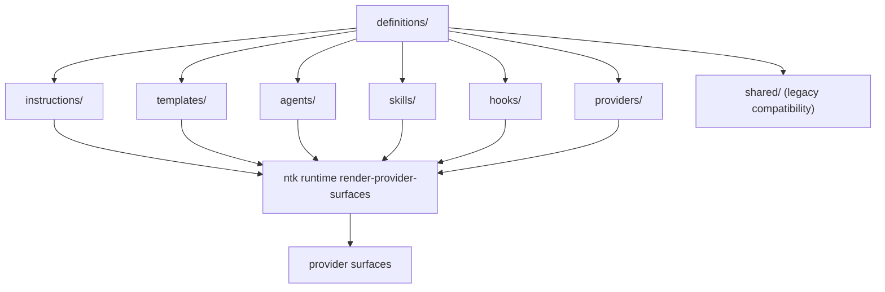

# Definitions Tree

> Repository-owned canonical non-code assets consumed by crates, runtime projections, and provider surfaces.

---

## Introduction

`definitions/` is the canonical root for repository-owned assets that are not application source code but still drive behavior across the workspace.

This tree now separates five canonical authored lanes:

- `instructions/` for stable engineering and governance rules
- `templates/` for reusable authored artifacts used in generation and documentation flows
- `agents/` for controller and specialist orchestration contracts
- `skills/` for reusable specialist capability packs
- `hooks/` for lifecycle-triggered runtime behaviors

`providers/` remains the consumer and projection side of the model.
The canonical extension-class contract is versioned in `definitions/templates/manifests/extension-governance.catalog.json`.
The canonical file-memory layering contract is versioned in `definitions/templates/manifests/operational-memory-layering.catalog.json`.

---

## Features

- ✅ Canonical roots for instructions, templates, agents, skills, and hooks
- ✅ Clear separation between authored definitions and provider-specific consumers
- ✅ Stable path contract for crate-driven generation and projection flows
- ✅ Canonical `definitions/templates/` now carries migrated docs/codegen templates plus the mirrored .NET scaffold tree
- ✅ Transitional compatibility while legacy `definitions/shared/` and root `templates/` are retired safely

---

## Contents

- [Introduction](#introduction)
- [Features](#features)
- [Contents](#contents)
- [Installation](#installation)
- [Quick Start](#quick-start)
- [Usage Examples](#usage-examples)
  - [Architecture](#architecture)
  - [Canonical Roots](#canonical-roots)
  - [Provider Consumers](#provider-consumers)
  - [Migration Policy](#migration-policy)
- [API Reference](#api-reference)
- [Build and Tests](#build-and-tests)
- [Contributing](#contributing)
- [Dependencies](#dependencies)
- [References](#references)
- [License](#license)

---

## Installation

No separate installation step is required. These assets are consumed directly from the repository root by workspace commands and provider-surface renderers.

---

## Quick Start

Author canonical non-code assets under `definitions/` first, then project them outward with the repository runtime commands.

---

## Usage Examples

- Inspect rules and governance assets under `definitions/instructions/`
- Inspect reusable authored assets under `definitions/templates/`
- Re-render provider surfaces with `ntk runtime render-provider-surfaces --repo-root .`

---

### Architecture



---

## Canonical Roots

- `instructions/` holds the shallow canonical rules board organized by `governance`, `development`, `operations`, `security`, and `data`.
- `templates/` holds canonical authored templates organized by `codegen`, `docs`, `manifests`, `prompts`, and `workflows`.
- `agents/` holds controller and specialist agent definitions such as `super-agent`, `planner`, `reviewer`, and `implementer`.
- `skills/` holds reusable capability packs grouped by engineering role.
- `hooks/` holds lifecycle entrypoints such as `session-start`, `pre-tool-use`, `subagent-start`, and `stop`.
- `templates/manifests/extension-governance.catalog.json` defines the shared extension taxonomy, authored roots, and loading boundaries across those lanes.
- `templates/manifests/operational-memory-layering.catalog.json` defines how curated memory, topic memory, and append-only notes stay distinct from planning and retrieval storage.

Each canonical root should be authored here first, then projected or consumed elsewhere.

---

## Provider Consumers

`definitions/providers/` remains the consumer side of the model.

- `github/` contains `.github/`-oriented surfaces and compatibility consumers.
- `vscode/` contains workspace and editor consumers.
- `codex/` contains Codex runtime, MCP, orchestration, and skill consumers.
- `claude/` contains Claude runtime and skill consumers.

Provider trees should consume canonical definitions instead of inventing parallel sources of truth.

---

## Migration Policy

This root is mid-migration and currently preserves compatibility on purpose.

- `definitions/shared/` remains available as the legacy canonical surface until all consumers are realigned.
- Root `templates/` remains available until its authored content is migrated into `definitions/templates/`.
- The reorganization must prefer copy-then-cutover over destructive moves so documents are not lost during path normalization.
- Human-facing examples belong in `docs/samples/`; canonical reusable authored assets belong in `definitions/templates/`.
- Future plugin packages remain a planned class and should not appear as ad-hoc roots until they have a manifest-backed contract and validation coverage.

---

## API Reference

Canonical roots exposed by `definitions/`:

- `instructions/`
- `templates/`
- `agents/`
- `skills/`
- `hooks/`
- `providers/`

---

## Build and Tests

Useful verification commands from the repository root:

```powershell
cargo run -q -p nettoolskit-cli -- validation instructions --repo-root . --warning-only false
cargo run -q -p nettoolskit-cli -- validation template-standards --repo-root . --warning-only false
cargo run -q -p nettoolskit-cli -- runtime render-provider-surfaces --repo-root .
```

---

## Contributing

Add or edit canonical assets in `definitions/` first. Update provider mirrors or generated runtime surfaces only after the authored source is correct and validation passes.

---

## Dependencies

This tree is consumed by:

- `crates/commands/runtime` render and projection commands
- `crates/commands/validation` governance, README, and template validators
- provider-specific consumers under `definitions/providers/*`

---

## References

- [definitions/instructions/README.md](instructions/README.md)
- [definitions/templates/README.md](templates/README.md)
- [definitions/agents/README.md](agents/README.md)
- [definitions/skills/README.md](skills/README.md)
- [definitions/hooks/README.md](hooks/README.md)
- [definitions/providers/README.md](providers/README.md)
- [definitions/shared/README.md](shared/README.md)
- [definitions/templates/manifests/extension-governance.catalog.json](templates/manifests/extension-governance.catalog.json)
- [definitions/templates/manifests/operational-memory-layering.catalog.json](templates/manifests/operational-memory-layering.catalog.json)
- [provider-surface-projection.catalog.json](providers/github/governance/provider-surface-projection.catalog.json)
- `ntk runtime render-provider-surfaces --repo-root .`

---

## License

This project is licensed under the MIT License. See the LICENSE file at the repository root for details.

---