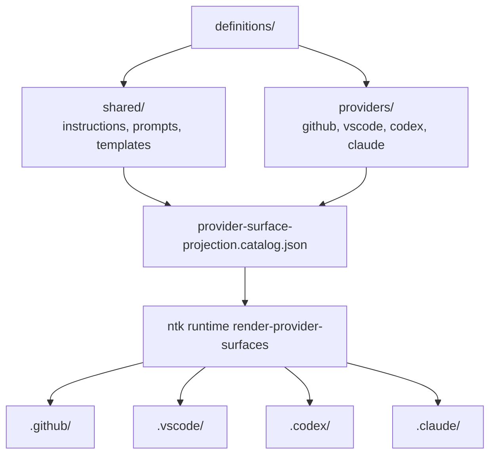

# Definitions Tree

> Repository-owned authoritative non-code assets projected into provider and editor surfaces.

---

## Introduction

`definitions/` is the canonical source tree for repository-owned non-code assets that must stay stable across provider, editor, and runtime projections.

The tree separates reusable shared assets from provider-authored overlays so the repository can render `.github/`, `.codex/`, `.claude/`, `.vscode/`, and related runtime surfaces without duplicating authority or drifting file names.

The authoritative projection map between authored definitions, generated exceptions, projected destinations, and renderer ownership lives in `.github/governance/provider-surface-projection.catalog.json`.

---

## Features

- ✅ Canonical shared assets reused across provider and runtime surfaces
- ✅ Provider-authored overlays kept separate from shared instructions, prompts, and templates
- ✅ Catalog-driven rendering with explicit renderer and projection ownership
- ✅ Stable provider replication model without hand-editing generated surfaces

---

## Contents

- [Introduction](#introduction)
- [Features](#features)
- [Contents](#contents)
  - [Architecture](#architecture)
  - [Shared Definitions](#shared-definitions)
  - [Provider Definitions](#provider-definitions)
  - [Projection Workflow](#projection-workflow)
- [References](#references)
- [License](#license)

---

### Architecture



---

## Shared Definitions

`definitions/shared/` owns canonical assets that should be authored once and projected many times.

- `instructions/` is the semantic rules board for repository guidance.
- `prompts/` stores reusable prompt and POML assets.
- `templates/` stores reusable authored templates that should not be duplicated in provider folders.

See [definitions/shared/README.md](shared/README.md) for the canonical shared-authority contract.

---

## Provider Definitions

`definitions/providers/` owns authored overlays that are intentionally provider-specific and should not be promoted into shared authority by default.

- `github/` contains repository-owned `.github/` authored surfaces.
- `vscode/` contains profile and workspace-authored VS Code surfaces.
- `codex/` contains Codex compatibility, orchestration, MCP, and skill-authored surfaces.
- `claude/` contains Claude runtime and skill-authored surfaces.

See [definitions/providers/README.md](providers/README.md) for the provider overlay contract.

---

## Projection Workflow

Provider replication is driven by the projection catalog and repository-owned renderers.

1. Author or update canonical shared or provider-specific assets under `definitions/`.
2. Keep the semantic taxonomy and stable `ntk-*` file names unchanged across canonical and projected copies.
3. Render runtime surfaces through the catalog-driven entrypoint:

```powershell
ntk runtime render-provider-surfaces --repo-root .
```

4. Validate projected surfaces against repository ownership and drift rules.

This keeps canonical authority inside `definitions/` while allowing provider/runtime folders to stay consumable by local tools and agents.

---

## References

- [definitions/shared/README.md](shared/README.md)
- [definitions/shared/instructions/README.md](shared/instructions/README.md)
- [definitions/shared/prompts/README.md](shared/prompts/README.md)
- [definitions/shared/prompts/poml/README.md](shared/prompts/poml/README.md)
- [definitions/providers/README.md](providers/README.md)
- [definitions/providers/github/README.md](providers/github/README.md)
- [definitions/providers/vscode/profiles/README.md](providers/vscode/profiles/README.md)
- [definitions/providers/vscode/workspace/README.md](providers/vscode/workspace/README.md)
- [definitions/providers/codex/mcp/README.md](providers/codex/mcp/README.md)
- [definitions/providers/codex/orchestration/README.md](providers/codex/orchestration/README.md)
- [definitions/providers/codex/scripts/README.md](providers/codex/scripts/README.md)
- [definitions/providers/codex/skills/README.md](providers/codex/skills/README.md)
- [.github/governance/provider-surface-projection.catalog.json](../.github/governance/provider-surface-projection.catalog.json)
- `ntk runtime render-provider-surfaces --repo-root .`

---

## License

This project is licensed under the MIT License. See the LICENSE file at the repository root for details.

---