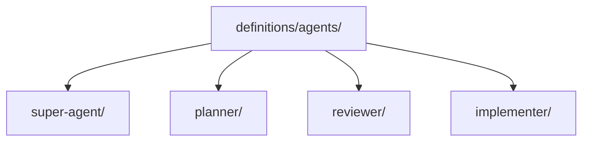

# Agent Definitions

> Canonical controller and specialist agent definitions used by repository orchestration flows.

---

## Purpose

`definitions/agents/` stores authored agent contracts that define controller and specialist behavior.

The root is intentionally small:

- `super-agent/`
- `planner/`
- `reviewer/`
- `implementer/`

---

### Architecture

---

## Notes

- `super-agent/` is the controller lane.
- Additional agent lanes should only be introduced when their role contract is materially different.

---