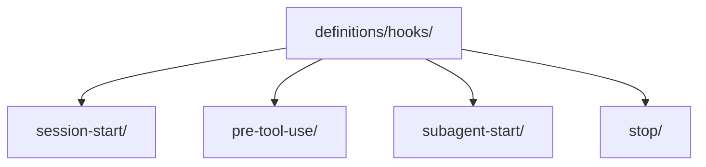

# Hook Definitions

> Canonical lifecycle hook definitions for repository-owned agent runtime events.

---

## Purpose

`definitions/hooks/` stores hook contracts organized by event boundary instead of by provider.

Current lanes:

- `session-start/`
- `pre-tool-use/`
- `subagent-start/`
- `stop/`

---

### Architecture

---

## Notes

- Hooks should stay event-scoped and minimal.
- Provider-specific installation or bootstrap belongs under `definitions/providers/`.

---