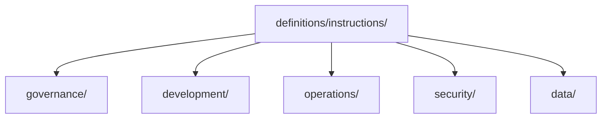

# Instruction Definitions

> Canonical repository instructions authored once and consumed by runtime and provider projections.

---

## Purpose

`definitions/instructions/` is the canonical root for stable instruction content.

The lane is intentionally shallow and uses five predictable categories:

- `governance/`
- `development/`
- `operations/`
- `security/`
- `data/`

Specialization should prefer stable `ntk-*` file names instead of deep folder nesting.

---

### Architecture

---

## Notes

- `definitions/shared/instructions/` remains available during migration.
- Author new canonical instruction content here first when the new lane exists.
- Provider consumers should eventually project from this root instead of from legacy paths.

---