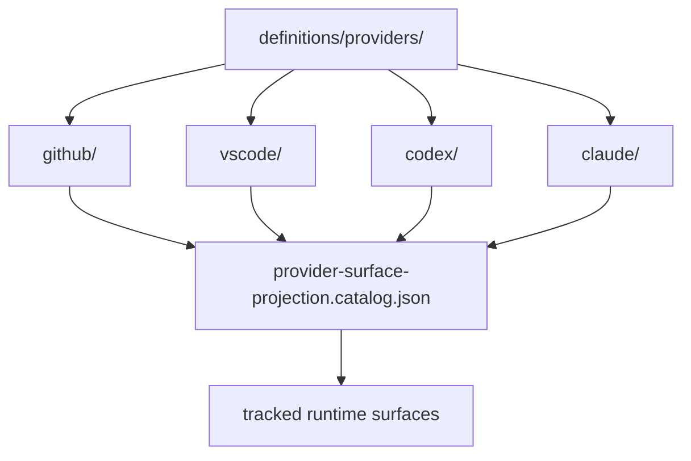

# Provider Definitions

> Provider-authored overlays that project canonical repository assets into specific runtime surfaces.

---

## Introduction

`definitions/providers/` contains authored overlays that are intentionally
provider-specific and should remain separate from the canonical roots under
`definitions/`.

These folders define provider/runtime-specific entrypoints, compatibility
surfaces, settings, and authored assets that the projection catalog renders into
tracked runtime locations.

---

## Features

- ✅ Keeps provider-specific authored assets out of shared authority
- ✅ Preserves a stable overlay contract for GitHub, VS Code, Codex, and Claude
- ✅ Supports catalog-driven projection into repository-managed runtime surfaces
- ✅ Avoids duplicating reusable instructions, prompts, and templates across providers

---

## Contents

- [Introduction](#introduction)
- [Features](#features)
- [Contents](#contents)
  - [Architecture](#architecture)
  - [Provider Boundaries](#provider-boundaries)
  - [Projection Contract](#projection-contract)
- [References](#references)
- [License](#license)

---

### Architecture



---

## Provider Boundaries

Each folder in `definitions/providers/` owns assets that are provider-specific
by design.

- `github/` owns authored `.github/` runtime surfaces such as root files,
  agents, chatmodes, prompts, and hooks.
- `vscode/` owns profile and workspace-authored surfaces for repository-local VS
  Code integration.
- `codex/` owns compatibility, orchestration, MCP, and skill-authored surfaces
  for Codex runtime integration.
- `claude/` owns runtime and skill-authored surfaces for Claude integration.

Reusable canonical assets should live under the canonical roots in
`definitions/instructions/`, `definitions/templates/`, `definitions/agents/`,
`definitions/skills/`, and `definitions/hooks/`.

`definitions/shared/` remains available only as a legacy compatibility surface
while consumer paths are being realigned.

---

## Projection Contract

Provider overlays stay authored here, then render into tracked runtime surfaces
through repository-owned projection rules.

- Shared canonical assets can flow into provider projections, but provider
  overlays do not automatically become shared authority.
- Projection behavior is catalog-driven, not folder-order-driven.
- Renderers and destinations are defined in
  `.github/governance/provider-surface-projection.catalog.json`.

Use the repository entrypoint to render provider surfaces:

```powershell
ntk runtime render-provider-surfaces --repo-root .
```

---

## References

- [definitions/README.md](../README.md)
- [definitions/instructions/README.md](../instructions/README.md)
- [definitions/templates/README.md](../templates/README.md)
- [definitions/agents/README.md](../agents/README.md)
- [definitions/skills/README.md](../skills/README.md)
- [definitions/hooks/README.md](../hooks/README.md)
- [definitions/shared/README.md](../shared/README.md)
- [definitions/providers/github/README.md](github/README.md)
- [definitions/providers/vscode/profiles/README.md](vscode/profiles/README.md)
- [definitions/providers/vscode/workspace/README.md](vscode/workspace/README.md)
- [definitions/providers/codex/mcp/README.md](codex/mcp/README.md)
- [definitions/providers/codex/orchestration/README.md](codex/orchestration/README.md)
- [definitions/providers/codex/scripts/README.md](codex/scripts/README.md)
- [definitions/providers/codex/skills/README.md](codex/skills/README.md)
- [.github/governance/provider-surface-projection.catalog.json](../../.github/governance/provider-surface-projection.catalog.json)

---

## License

This project is licensed under the MIT License. See the LICENSE file at the repository root for details.

---