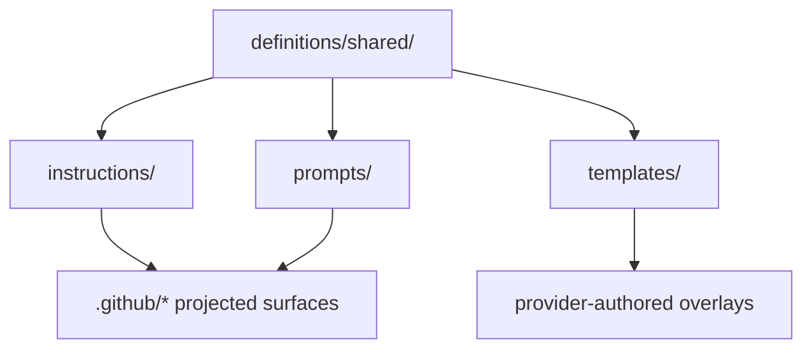

# Shared Definitions

> Canonical shared assets reused across multiple repository surfaces.

---

## Introduction

`definitions/shared/` contains repository-owned source artifacts that are shared
across provider and runtime surfaces. The folder is the authoritative input for
instruction, prompt, and template content that gets projected into tracked
workspace surfaces.

---

## Features

- ✅ Shared instruction assets are authored once and projected into
  `.github/instructions/`
- ✅ Shared prompt assets are authored once and projected into
  `.github/prompts/poml/`
- ✅ Shared templates stay reusable instead of being duplicated across provider
  folders
- ✅ The folder keeps canonical documentation separate from generated or
  provider-specific runtime surfaces

---

## Contents

- [Introduction](#introduction)
- [Features](#features)
- [Contents](#contents)
  - [Architecture](#architecture)
  - [Shared Asset Boundaries](#shared-asset-boundaries)
  - [Projection Contract](#projection-contract)
- [References](#references)
- [License](#license)

---

### Architecture

---

## Shared Asset Boundaries

`definitions/shared/` should only hold assets that are intentionally reusable
across more than one provider or runtime surface.

- `instructions/` is the canonical semantic rules board for repository guidance.
- `prompts/` stores reusable prompt entry content and POML prompt assets.
- `templates/` stores reusable authored templates that provider trees may
  consume but should not fork without an explicit reason.

Provider-specific runtime behavior belongs under `definitions/providers/`, not
here.

---

## Projection Contract

Shared assets keep canonical authority even when projected into runtime
surfaces.

- Canonical source: `definitions/shared/`
- Projected runtime surface: `.github/`, `.codex/`, `.claude/`, `.vscode/`
- Ownership and projection rules: `.github/governance/provider-surface-projection.catalog.json`
- Naming contract: semantic domain folders plus stable `ntk-*` file names for
  instruction assets

Do not edit generated runtime surfaces in place when the canonical shared asset
already exists here.

---

## References

- [definitions/README.md](../README.md)
- [definitions/providers/README.md](../providers/README.md)
- [definitions/shared/instructions/README.md](instructions/README.md)
- [definitions/shared/prompts/README.md](prompts/README.md)
- [definitions/shared/prompts/poml/README.md](prompts/poml/README.md)
- [Repository README Rules](../../.github/instructions/docs/ntk-docs-repository-readme-overrides.instructions.md)
- [README Template](../../.github/templates/readme-template.md)
- [.github/governance/provider-surface-projection.catalog.json](../../.github/governance/provider-surface-projection.catalog.json)

---

## License

This project is licensed under the MIT License. See the LICENSE file at the repository root for details.

---