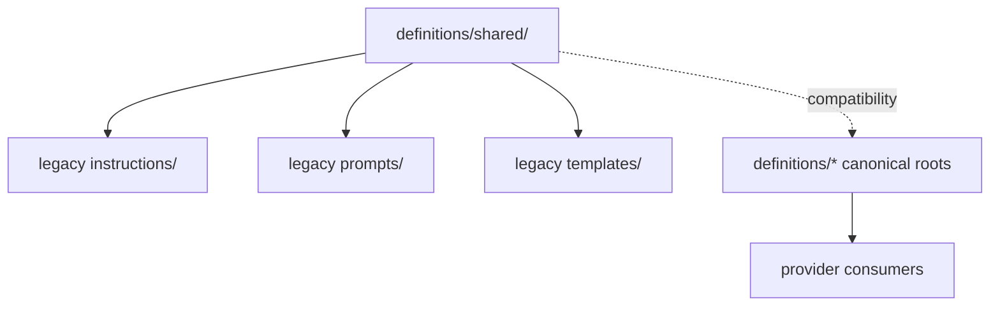

# Shared Definitions

> Legacy compatibility surface preserved while canonical roots move to shallow top-level lanes under `definitions/`.

---

## Introduction

`definitions/shared/` remains available to avoid breaking legacy consumers
while canonical authored roots have already moved to:

- `definitions/instructions/`
- `definitions/templates/`
- `definitions/agents/`
- `definitions/skills/`
- `definitions/hooks/`

Do not treat this folder as the long-term target structure for new authored
content when an equivalent canonical root already exists.

---

## Features

- ✅ Preserves existing consumers while canonical paths are being introduced
- ✅ Keeps older projections functioning during migration
- ✅ Reduces risk of document loss by using copy-then-cutover instead of destructive moves
- ✅ Provides a compatibility checkpoint while providers are realigned

---

## Contents

- [Introduction](#introduction)
- [Features](#features)
- [Contents](#contents)
- [Installation](#installation)
- [Quick Start](#quick-start)
- [Usage Examples](#usage-examples)
  - [Architecture](#architecture)
  - [Shared Asset Boundaries](#shared-asset-boundaries)
  - [Projection Contract](#projection-contract)
- [API Reference](#api-reference)
- [Build and Tests](#build-and-tests)
- [Contributing](#contributing)
- [Dependencies](#dependencies)
- [References](#references)
- [License](#license)

---

## Installation

No separate installation step is required. `definitions/shared/` remains a compatibility lane consumed by existing repository tooling while canonical roots complete cutover.

---

## Quick Start

Prefer canonical authored roots under `definitions/`, and consult `definitions/shared/` only when a consumer has not been realigned yet.

---

## Usage Examples

- Check the compatibility instruction lane in `definitions/shared/instructions/`
- Check the remaining shared prompt lane in `definitions/shared/prompts/`
- Use `ntk validation authoritative-source-policy --repo-root .` to verify migration-time source ownership

---

### Architecture



---

## Shared Asset Boundaries

`definitions/shared/` should now be treated as a migration compatibility lane.

- keep existing consumers working until their canonical root is in place
- prefer authoring new root-level canonical content under `definitions/`
- do not create new long-lived taxonomy branches here when an equivalent root
  exists already

---

## Projection Contract

`definitions/shared/` is now compatibility-first.

- Transitional compatibility source: `definitions/shared/`
- Preferred canonical source: `definitions/instructions/`, `definitions/templates/`, `definitions/agents/`, `definitions/skills/`, `definitions/hooks/`
- Remaining authored shared prompt lane: `definitions/shared/prompts/` and `definitions/shared/prompts/poml/`
- Projected runtime surface: `.github/`, `.codex/`, `.claude/`, `.vscode/`
- Ownership and projection rules: `definitions/providers/github/governance/provider-surface-projection.catalog.json`
- Naming contract: semantic domain folders plus stable `ntk-*` file names for
  instruction assets

Do not delete or force-move existing shared content until all known consumers
have been realigned.

---

## API Reference

Compatibility-first subtrees currently kept under `definitions/shared/`:

- `instructions/`
- `prompts/`
- `templates/`

---

## Build and Tests

Useful verification commands from the repository root:

```powershell
cargo run -q -p nettoolskit-cli -- validation authoritative-source-policy --repo-root . --warning-only false
cargo run -q -p nettoolskit-cli -- validation instructions --repo-root . --warning-only false
```

---

## Contributing

Do not add new long-lived authored roots here when an equivalent canonical path already exists under `definitions/`. Use copy-first migration steps so consumers can be cut over safely.

---

## Dependencies

This compatibility tree is still read by:

- older provider mirrors during migration
- shared prompt projection flows
- validation code that preserves temporary fallback behavior

---

## References

- [definitions/README.md](../README.md)
- [definitions/instructions/README.md](../instructions/README.md)
- [definitions/templates/README.md](../templates/README.md)
- [definitions/agents/README.md](../agents/README.md)
- [definitions/skills/README.md](../skills/README.md)
- [definitions/hooks/README.md](../hooks/README.md)
- [definitions/providers/README.md](../providers/README.md)
- [definitions/shared/instructions/README.md](instructions/README.md)
- [definitions/shared/prompts/README.md](prompts/README.md)
- [definitions/shared/prompts/poml/README.md](prompts/poml/README.md)
- [Repository README Rules](../../.github/instructions/docs/ntk-docs-repository-readme-overrides.instructions.md)
- [README Template](../templates/docs/readme-template.md)
- [provider-surface-projection.catalog.json](../providers/github/governance/provider-surface-projection.catalog.json)

---

## License

This project is licensed under the MIT License. See the LICENSE file at the repository root for details.

---