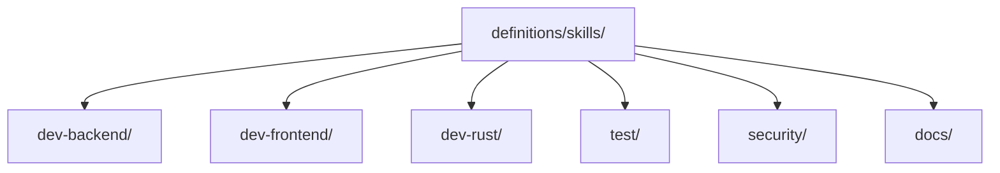

# Skill Definitions

> Canonical reusable skill packs aligned to stable engineering role boundaries.

---

## Purpose

`definitions/skills/` stores reusable specialist capability packs that can be projected into provider runtimes without rewriting their intent each time.

Current root lanes:

- `dev-backend/`
- `dev-frontend/`
- `dev-rust/`
- `test/`
- `security/`
- `docs/`

---

### Architecture

---

## Notes

- Skill roots should stay capability-oriented, not provider-oriented.
- Provider-specific packaging belongs under `definitions/providers/`.

---