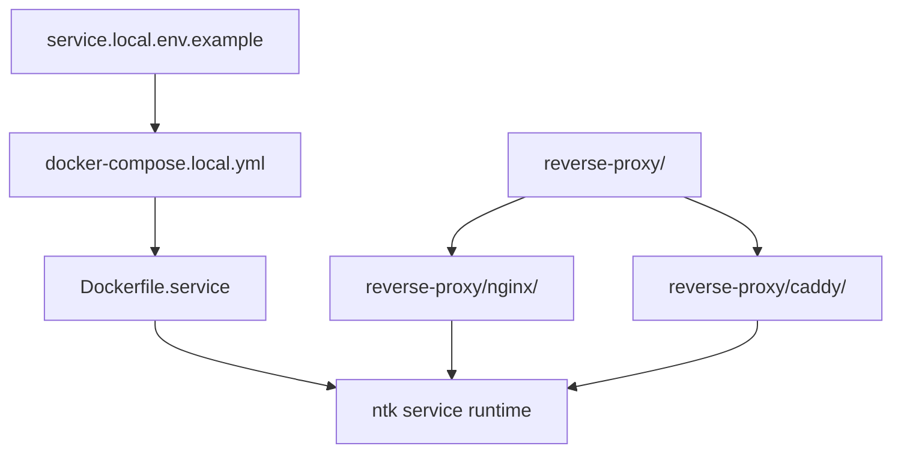

# Deployment Assets

> Local service, reverse-proxy, and container deployment artifacts owned by the repository.

---

## Introduction

`deployments/` stores repository-owned deployment assets for local service hosting, reverse-proxy integration, and container-based runtime experiments.

These files are operational artifacts, not the primary implementation surface. They support local service mode, reverse-proxy validation, and environment setup around the native `ntk` runtime.

---

## Features

- ✅ Local service container assets for repository runtime workflows
- ✅ Reverse-proxy overlays for Nginx and Caddy based setups
- ✅ Example environment configuration for local service bootstrapping
- ✅ Deployment-side assets kept separate from canonical definitions and runtime code

---

## Contents

- [Introduction](#introduction)
- [Features](#features)
- [Contents](#contents)
  - [Architecture](#architecture)
  - [Deployment Assets](#deployment-assets)
  - [Quick Start](#quick-start)
- [References](#references)
- [License](#license)

---

### Architecture



---

## Deployment Assets

- `Dockerfile.service` builds the local service container image.
- `docker-compose.local.yml` defines a local container composition for service mode.
- `service.local.env.example` provides example environment variables for local service execution.
- `reverse-proxy/nginx/` stores Nginx-oriented proxy assets.
- `reverse-proxy/caddy/` stores Caddy-oriented proxy assets.

These assets complement the runtime and service documentation instead of replacing the native `ntk` operational surface.

---

## Quick Start

```powershell
copy .\deployments\service.local.env.example .\deployments\service.local.env
docker compose -f .\deployments\docker-compose.local.yml up --build
```

---

## References

- [Repository README](../README.md)
- [Dockerfile.service](Dockerfile.service)
- [docker-compose.local.yml](docker-compose.local.yml)
- [service.local.env.example](service.local.env.example)
- [docs/operations/service-mode-local-deployment.md](../docs/operations/service-mode-local-deployment.md)
- [docs/operations/chatops-reverse-proxy-and-bot-routing.md](../docs/operations/chatops-reverse-proxy-and-bot-routing.md)

---

## License

This project is licensed under the MIT License. See the LICENSE file at the repository root for details.

---