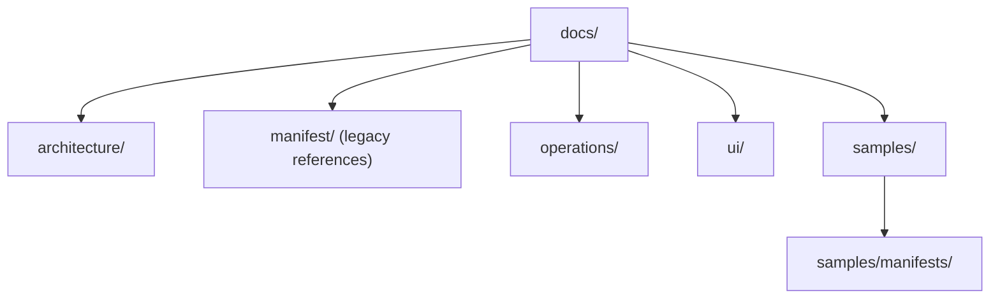

# Documentation Tree

> Stable human-facing documentation for architecture, operations, UI guidance, and examples.

---

## Introduction

`docs/` stores reference material for humans.

This tree should hold stable documentation, runbooks, and examples that explain the system. It should not become the canonical source of provider instructions, templates, or active planning state.

---

## Features

- ✅ Stable architecture and operator-facing documentation
- ✅ Human-readable operational runbooks and UI guidance
- ✅ Sample manifests and examples separated from canonical generated templates
- ✅ Clear boundary between documentation, planning, and definitions

---

## Contents

- [Introduction](#introduction)
- [Features](#features)
- [Contents](#contents)
  - [Architecture](#architecture)
  - [Documentation Domains](#documentation-domains)
  - [Definitions Boundary](#definitions-boundary)
- [References](#references)
- [License](#license)

---

### Architecture

---

## Documentation Domains

- `architecture/` contains control-plane and operator-model references.
- `operations/` contains runbooks for incident response, release verification, reverse proxy routing, and service mode.
- `operations/` also contains the AI development operator playbook for profile selection, diagnostics, and degraded-state troubleshooting.
- `operations/` also contains the runtime diagnostics playbook that defines health-state meaning, degraded-state evidence, and subsystem troubleshooting ownership.
- `ui/` contains UX guidance and visual support artifacts for terminal-facing experiences.
- `samples/` contains human-facing examples that illustrate stable authored concepts.
- `samples/manifests/` contains example manifests meant for understanding and copying, not canonical generation.
- `manifest/` remains available as a legacy documentation lane while manifest material is normalized across the new documentation and template structure.

---

## Definitions Boundary

Keep these roles separate:

- `docs/` explains.
- `planning/` tracks work in progress.
- `definitions/` defines canonical reusable assets.

When a manifest or document is meant to be consumed by generation or runtime tooling, it belongs under `definitions/templates/`. When it is meant to teach operators or contributors, it belongs under `docs/`.

---

## References

- [Repository README](../README.md)
- [docs/architecture/control-plane-session-operator-model.md](architecture/control-plane-session-operator-model.md)
- [docs/operations/incident-response-playbook.md](operations/incident-response-playbook.md)
- [docs/operations/ai-development-operator-playbook.md](operations/ai-development-operator-playbook.md)
- [docs/operations/runtime-diagnostics-observability-playbook.md](operations/runtime-diagnostics-observability-playbook.md)
- [docs/operations/release-artifact-verification.md](operations/release-artifact-verification.md)
- [docs/operations/service-mode-local-deployment.md](operations/service-mode-local-deployment.md)
- [docs/ui/tui-ux-guidelines.md](ui/tui-ux-guidelines.md)
- [docs/samples/README.md](samples/README.md)
- [docs/samples/manifests/README.md](samples/manifests/README.md)
- [docs/samples/manifests/runtime-diagnostics.taxonomy.sample.json](samples/manifests/runtime-diagnostics.taxonomy.sample.json)
- [planning/README.md](../planning/README.md)
- [definitions/templates/README.md](../definitions/templates/README.md)

---

## License

This project is licensed under the MIT License. See the LICENSE file at the repository root for details.

---