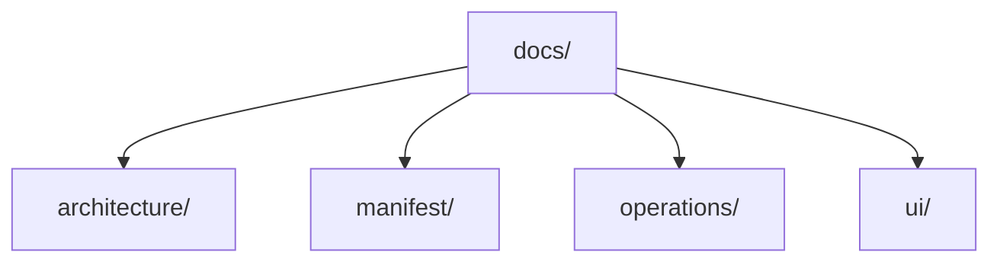

# Documentation Tree

> Repository-owned architecture, operations, manifest, and UI reference documentation.

---

## Introduction

`docs/` stores long-lived technical documentation that should remain outside transient planning artifacts and outside provider-specific instruction surfaces.

This tree captures reference material for control-plane design, manifest behavior, operational runbooks, and UI guidance that supports the Rust workspace and the `ntk` runtime.

---

## Features

- ✅ Architecture references for control-plane and operator-facing runtime design
- ✅ Operational runbooks for incidents, release verification, service mode, and ChatOps routing
- ✅ Manifest-specific reference material for acceptance, layering, and artifact contracts
- ✅ UI guidance for terminal experience and visual consistency

---

## Contents

- [Introduction](#introduction)
- [Features](#features)
- [Contents](#contents)
  - [Architecture](#architecture)
  - [Documentation Domains](#documentation-domains)
- [References](#references)
- [License](#license)

---

### Architecture

---

## Documentation Domains

- `architecture/` contains control-plane and operator-model reference documentation.
- `manifest/` contains manifest-specific acceptance, artifact, feature, and layering references.
- `operations/` contains runbooks for incident response, release verification, reverse-proxy routing, and service mode.
- `ui/` contains UX guidance and visual support artifacts for terminal-facing experiences.

This tree should hold stable technical reference material, not active plans or generated provider runtime surfaces.

---

## References

- [Repository README](../README.md)
- [docs/architecture/control-plane-session-operator-model.md](architecture/control-plane-session-operator-model.md)
- [docs/operations/incident-response-playbook.md](operations/incident-response-playbook.md)
- [docs/operations/release-artifact-verification.md](operations/release-artifact-verification.md)
- [docs/operations/service-mode-local-deployment.md](operations/service-mode-local-deployment.md)
- [docs/ui/tui-ux-guidelines.md](ui/tui-ux-guidelines.md)
- [planning/README.md](../planning/README.md)

---

## License

This project is licensed under the MIT License. See the LICENSE file at the repository root for details.

---