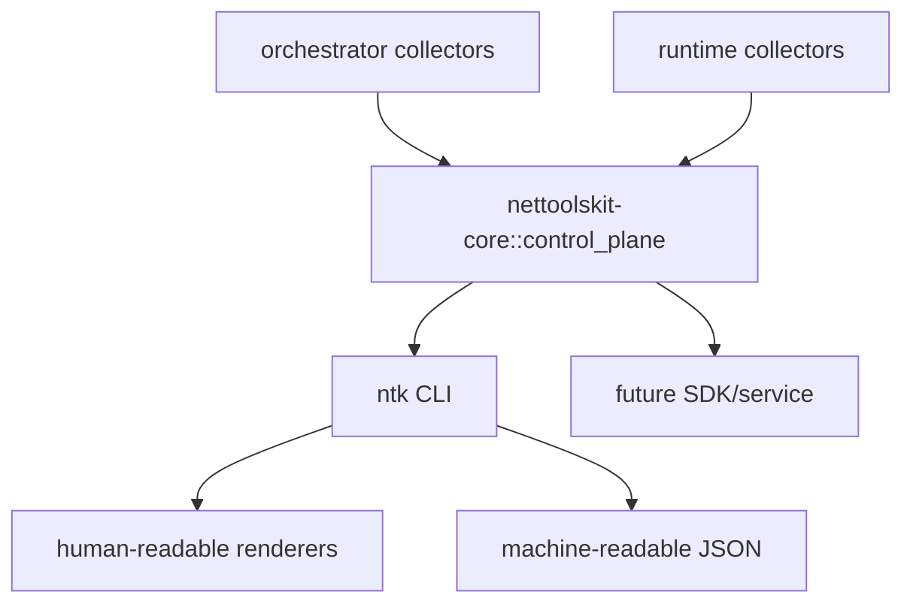

# Control-Plane Introspection Model

> Canonical model for machine-readable runtime inspection contracts exposed by CLI and future SDK or service consumers.

---

## Purpose

This repository now distinguishes between:

- human-readable doctor output for operators
- machine-readable control schemas for automation, tests, and future SDK/service reuse

The canonical manifest for those machine-readable contracts lives in:

- `definitions/templates/manifests/control-plane-introspection.catalog.json`

Use this document for human architecture guidance. Use the catalog for stable surface ids, schema kinds, and versioning rules.

---

## Current Surfaces

| Surface | CLI entry point | Schema kind | Owned by |
| --- | --- | --- | --- |
| AI doctor | `ntk ai doctor --json-output` | `ai_doctor` | `crates/orchestrator/src/execution/ai_doctor.rs` |
| AI profile catalog | `ntk ai profiles list --json-output` | `ai_provider_profiles` | `crates/orchestrator/src/execution/ai_profiles.rs` |
| AI profile detail | `ntk ai profiles show --json-output` | `ai_provider_profile` | `crates/orchestrator/src/execution/ai_profiles.rs` |
| Runtime doctor | `ntk runtime doctor --json-output` | `runtime_doctor` | `crates/commands/runtime/src/diagnostics/doctor.rs` |
| Runtime healthcheck | `ntk runtime healthcheck --json-output` | `runtime_healthcheck` | `crates/commands/runtime/src/diagnostics/healthcheck.rs` |
| Runtime self-heal | `ntk runtime self-heal --json-output` | `runtime_self_heal` | `crates/commands/runtime/src/diagnostics/self_heal.rs` |
| Local context query | `ntk runtime query-local-context-index --json-output` | `local_context_query` | `crates/commands/runtime/src/continuity/local_context.rs` |
| Local memory query | `ntk runtime query-local-memory --json-output` | `local_memory_query` | `crates/commands/runtime/src/continuity/local_context.rs` |

All machine-readable surfaces are defined in `nettoolskit-core` under `crates/core/src/control_plane.rs`.

---

## Architecture

---

## Boundary Rules

- Machine-readable inspection must serialize the shared control schema, not crate-local internal structs.
- Human-readable CLI text remains an adapter and may evolve independently as long as the typed schema stays stable.
- New doctor/report/continuity surfaces should add a schema kind and versioned contract before exposing JSON intended for automation.
- Provider/runtime-specific raw structs are allowed behind the collector boundary, but they are not the public inspection contract.

---

## Versioning Guidance

- `schema_version` is the first compatibility gate for automation.
- `schema_kind` is the stable document discriminator for downstream tooling.
- Breaking changes require a schema version increment before removing, renaming, or retyping fields.
- Additive fields can stay on the same schema version when they preserve existing consumers.

---

## Related References

- [Repository README](../../README.md)
- [Runtime Diagnostics And Observability Playbook](../operations/runtime-diagnostics-observability-playbook.md)
- [Control Plane, Session, And Operator Model](control-plane-session-operator-model.md)
- [Control-plane introspection catalog sample](../samples/manifests/control-plane-introspection.catalog.sample.json)

---