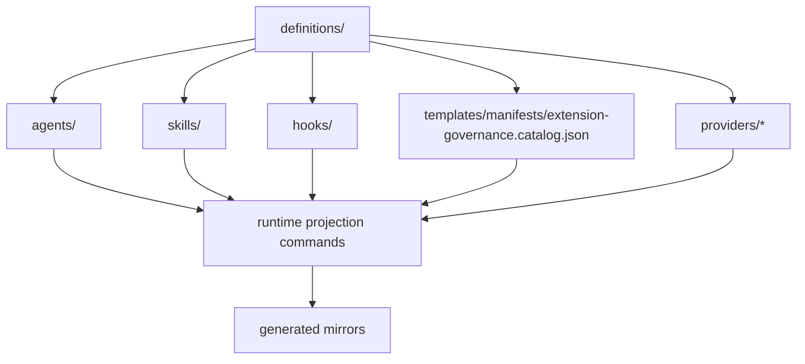

# Extension Governance Model

> Canonical model for how agents, skills, hooks, prompts, provider projections, and future plugins are classified, discovered, and governed in this repository.

---

## Purpose

This repository has multiple extension-like surfaces, but they do not all behave the same way.

The canonical machine-readable contract lives in:

- `definitions/templates/manifests/extension-governance.catalog.json`

Use this document for human architecture guidance. Use the catalog for stable class names, authored roots, and loading boundaries.

---

## Extension Classes

| Class | Canonical root | Ownership | Role |
| --- | --- | --- | --- |
| Agent | `definitions/agents/` | repository-owned | orchestration role and lane defaults |
| Skill | `definitions/skills/` | repository-owned | reusable specialist capability pack |
| Hook | `definitions/hooks/` | repository-owned | lifecycle-triggered runtime behavior |
| Prompt | `definitions/providers/*/prompts/` | provider-consumer | consumer-facing prompt asset |
| Runtime projection | `definitions/providers/*/` | provider-consumer | generated or rendered provider/editor/runtime surface |
| Plugin | reserved future lane | planned | explicit extension package, not yet first-class |

---

## Architecture

---

## Discovery Rules

- Agents, skills, and hooks are discovered from canonical repository-owned roots under `definitions/`.
- Prompts and runtime projections are provider-consumer assets and should not be treated as authored instruction roots.
- Future plugins are reserved until they have an explicit manifest contract and validator coverage.
- Hidden extension roots are not allowed.

---

## Loading Boundaries

- Agents must not bypass instructions, token-economy policy, or provider routing.
- Skills must not bypass instructions, MCP governance, or runtime validation.
- Hooks must stay bound to explicit lifecycle events and repository-owned safety checks.
- Provider prompts must not silently redefine repository-owned policy.
- Runtime projections must consume canonical definitions rather than becoming new sources of truth.

---

## Operator Guidance

- Author new extension assets under `definitions/` first.
- Treat `.github/.codex/.claude/.vscode` as projection targets, not authored extension roots.
- If a proposed extension does not fit one of the classes above, add a manifest-backed class before adding the files.

---

## Related References

- [Definitions Tree](../../definitions/README.md)
- [Repository README](../../README.md)
- [Extension governance sample](../samples/manifests/extension-governance.catalog.sample.json)

---