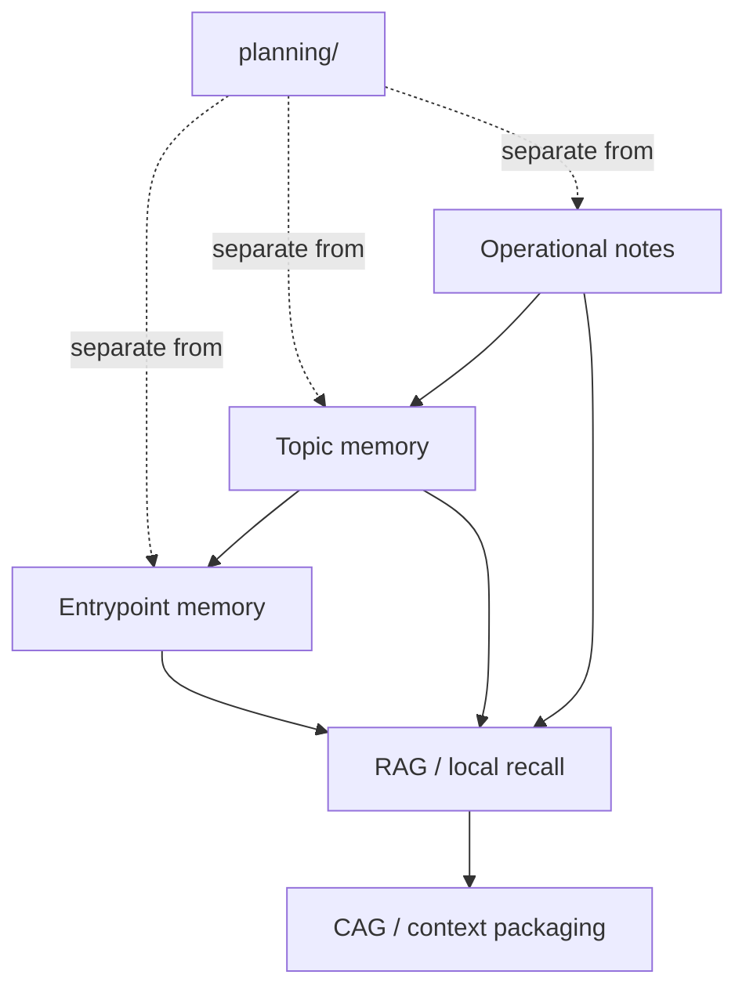

# Operational Memory Layering Model

> Canonical model for how concise memory, topic memory, and append-only operational notes coexist with planning artifacts and SQLite-backed recall.

---

## Purpose

This repository needs operational memory without turning `planning/` or raw logs into a generic context dump.

The canonical machine-readable contract lives in:

- `definitions/templates/manifests/operational-memory-layering.catalog.json`

Use this document for human guidance. Use the catalog for stable layer names, editorial rules, and retrieval-alignment expectations.

---

## Memory Layers

| Layer | Role | What belongs there |
| --- | --- | --- |
| Concise entrypoint memory | always-loadable stable context | durable recall anchors and small high-value facts |
| Topic memory | curated detail by subsystem or topic | reviewed facts that expand one stable area |
| Operational notes | append-only raw capture | transient findings, observations, and raw note intake |

---

## Architecture

---

## Editorial Rules

- Keep the entrypoint layer small and durable.
- Use topic memory for curated subsystem detail, not for active task tracking.
- Treat operational notes as input for later distillation, not as the final recall surface.
- Keep plans, specs, and task execution artifacts under `planning/`, not in memory files.

---

## Retrieval Alignment

- RAG may index layered memory files as evidence.
- CAG may compact the retrieved memory into bounded prompt context.
- SQLite recall complements this model; it does not replace the editorial structure.
- Raw operational notes should not dominate always-loaded context.

---

## Operator Workflow

1. Capture raw findings in operational notes.
2. Distill recurring or durable knowledge into topic memory.
3. Promote only the smallest stable anchors into the concise entrypoint.
4. Keep planning artifacts separate even when they inform memory updates.

---

## Related References

- [Repository README](../../README.md)
- [Definitions Tree](../../definitions/README.md)
- [Operational memory layering sample](../samples/manifests/operational-memory-layering.catalog.sample.json)

---