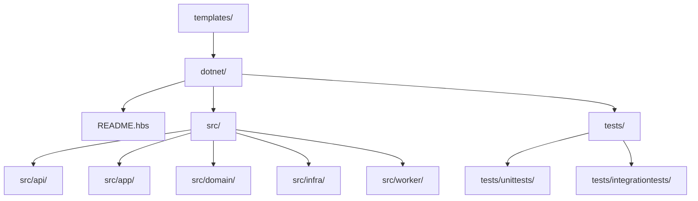

# Template Assets

> Transitional root template tree preserved while canonical authored templates move into `definitions/templates/`.

---

## Introduction

`templates/` stores authored scaffolding assets that the repository uses for project generation and template-driven workflows.

The current tree is focused on `.NET` project scaffolding, with layered source and test templates plus a generated README template for output projects.

This root is now transitional. Canonical authored templates are moving toward `definitions/templates/` so generation inputs and provider consumers can share one definition root.

---

## Features

- ✅ Preserves existing `.NET` scaffolding assets during migration
- ✅ Keeps generated project outputs separate from authored inputs
- ✅ Maintains a safe cutover path toward `definitions/templates/`
- ✅ Avoids destructive moves while the new canonical template taxonomy is introduced

---

## Contents

- [Introduction](#introduction)
- [Features](#features)
- [Contents](#contents)
  - [Architecture](#architecture)
  - [Template Domains](#template-domains)
- [References](#references)
- [License](#license)

---

### Architecture

---

## Template Domains

The current template tree contains:

- `dotnet/README.hbs` for generated project README content
- `dotnet/src/api/` for API-layer assets
- `dotnet/src/app/` for application-layer assets
- `dotnet/src/domain/` for domain-layer assets
- `dotnet/src/infra/` for infrastructure-layer assets
- `dotnet/src/worker/` for worker/service assets
- `dotnet/tests/unittests/` for unit-test scaffolding
- `dotnet/tests/integrationtests/` for integration-test scaffolding

Templates are authored inputs. Generated projects should not be edited back into this tree.

New canonical reusable templates should prefer `definitions/templates/` when the corresponding lane already exists.

---

## References

- [Repository README](../README.md)
- [definitions/templates/README.md](../definitions/templates/README.md)
- [templates/dotnet/README.hbs](dotnet/README.hbs)
- [crates/commands/templating/README.md](../crates/commands/templating/README.md)
- [definitions/shared/README.md](../definitions/shared/README.md)

---

## License

This project is licensed under the MIT License. See the LICENSE file at the repository root for details.

---